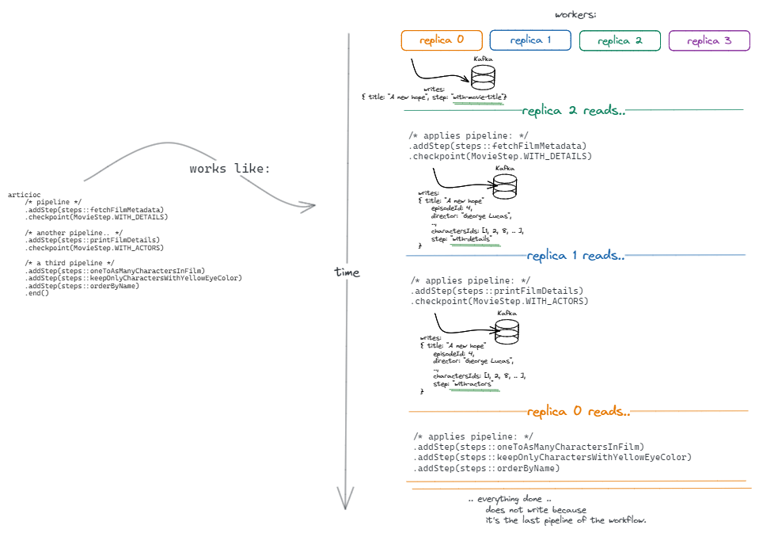

# Articioc


Articioc is a durable-workflows library with a rule in mind: Let developers build pipelines of operations that scales with their infrastructure.

### How it works

The core: define the pipeline with your business logic.

```java
Provider<StarWarsCharacterInMovie> provider = new InMemoryProvider<>();
var builder = new Articioc.Builder<>(provider, MovieStep.WITH_MOVIE_TITLE);

var articioc = builder
    .addStep(steps::fetchFilmMetadata)
    .checkpoint(MovieStep.WITH_DETAILS)
    .addStep(steps::printFilmDetails)
    .checkpoint(MovieStep.WITH_ACTORS)
    .addStep(steps::oneToAsManyCharactersInFilm)
    .addStep(steps::keepOnlyCharactersWithYellowEyeColor)
    .addStep(steps::orderByName)
    .end();
```


# Key elements
## Provider

A provider is an interface that allows to write and read.
The idea is that behind it everything can be mapped: a queue, a database, the process memory.

The provider implementation is crucial because it's what actually allow the pipeline to cooperate and scale (see below).

```java
Provider<StarWarsCharacterInMovie> provider = new InMemoryProvider<>();
```

In this example there is a simple implementation of a provider: *InMemoryProvider*.
In this case when the pipeline needs to *store* a *checkpoint* it will write into the process' memory so the reader will be the process itself.

A more complex provider could *store* the *records* into an external system. That means that each *record* could be dispatched
to every available *reader* (aka the worker).

## Leaf and ```.addStep(..)```

We can refer to a ```Leaf``` as a record that carries data and metadata around the world.

```java
public class StarWarsCharacterInMovie extends Leaf<MovieStep> {
    private final String title;
    
    private Integer episode;
    private String director;
    private String producer;
    private LocalDate releaseDate;
    private List<String> charactersIds;
    private StarWarsCharacter character;
    
    public StarWarsCharacterInMovie(String title) {
      super(null, MovieStep.WITH_MOVIE_TITLE);
      this.title = title;
    }
    
    @Override
    public String key() {
      return this.title;
    }
    
    /* ... other methods ... */
}
```

```Leaf``` that defines the mandatory metadata need in order to let the workflow run.

A *record* is pass through the entire workflow so it must define all the information needed by each step to run.

Indeed, each step leverages on a simple rule: *takes as input a stream of records and returns a stream of records*.
Then there are different abstractions that allows to deal with it in different ways but under the hood all is reduced to this rule.

In this way each step could work as:
- **map**: 1-1 mapping of a value into a new one;
- **explode**: 1-N a single record could be mapped into a list of records;
- **filter**: 1-0 if a records needs to be stopped or filtered out it's just the matter or return an empty collection.


There are different implementation of the method: ```.addStep(..)``` in order to deal with different kind of scenario,
some examples:

### one-to-one
```java
/*
 * This is a one-to-one operation.
 * That means that given a single record in input it will produce a single record in output.
 * It could be the exact same object without changes, modified or a completely fresh new object. */
.addStep(steps::fetchFilmMetadata)
```

### one-to-many
```java
/* This is a one-to-many operation.
 * Starting from a single record it explodes it into a stream of records for each character into the input. */
.addStep(steps::oneToAsManyCharactersInFilm)
```

```java
/*
 * This is a one-to-many operation… but "many" in this case could even mean 0.
 * Each step could produce 0, 1 or N records.
 * In this way each step could work as:
 * - map: 1-1 mapping of a value into a new one;
 * - explode: 1-N a single record could be mapped into a list of records;
 * - filter: 1-0 if a records needs to be stopped or filtered out it's just the matter or return an empty collection. */
.addStep(steps::keepOnlyCharactersWithYellowEyeColor)
```
### many-to-many

```java
/*
 * This is a many-to-many operation.
 * This kind of step will receive a collection of records so the logic can manipulate them together.
 * This is helpful for all the operations that needs to know the whole context in order to operate, like:
 *  sorting, distinct, filtering, grouping, reduce, etc.
 *
 * A point of attention MUST be explained.
 * If this step is called as first one after a checkpoint it will receive a collection of a single record.
 * When reading from a provider then records are treat independently.
 *   That means that each one will be the applied to the local pipeline
 *   as a collection of a single element.
 * Then the pipeline in it various steps could explode this single input into multiple records,
 *   and in this case the collection that this kind of steps will receive
 *   will contain more the one element.
 * */
.addStep(steps::orderByName)
```


# Checkpoint and Steps

Each *Leaf* MUST carry a *step*.

A *step* is the metadata that lets the engine recognize which operations the workflow performed so it can apply the success
pipeline without repeat already executed steps.

```java
public static class CharactersInMovieSteps extends Step {
    public static final CharactersInMovieSteps WITH_MOVIE_TITLE = new CharactersInMovieSteps("with-movie-title");
    public static final CharactersInMovieSteps WITH_DETAILS = new CharactersInMovieSteps("with-details");
    public static final CharactersInMovieSteps WITH_ACTORS = new CharactersInMovieSteps("with-actors");
    
    public CharactersInMovieSteps(String name) {
        super(name);
    }
}
```

```java
/*
 * .checkpoint(..) generates a side-effect forcing the library to write records into the provider.
 * This means that, dependently to the provider implementation, records will be stored (in memory, serialized into a datastore, etc.)
 *   and since that point will be treated independently.
 * Independently means that to the .checkpoint(..) will reach by a stream of records (0, 1 o hypothetically infinite),
 *   the stream of records will be written to the provider and then dependently to the modality in which data is read from the provider
 *   records will be retrieved and processed.
 * It's VERY IMPORTANT understand that inside a local pipeline the records enters independently but then,
 *   if they explode and an operation one-to-many generates from a single record 2 or more records they will be treated together
 *   into the local pipeline, until they'll be written into the provider, at the point. the next operation will read them one by one
 *   executing a local pipeline on each record read from the provider. */
.checkpoint(MovieStep.WITH_DETAILS)
```

## Scale with your infrastructure

Internally the above workflow splits into smaller *pipelines*; *a pipeline is executed into the local process by the worker*. 
This, mixed with the provider, is the formula that lets you scale with your infrastructure.

Let's think about our example: Star Wars Movies.
In our workflow the movie "A new hope" enters into the pipeline, and then it's through pipelines and steps.

Now let's think that we have 4 running process of our workflows (4 shell in which the jar is running, 4 replicas on k8s, whatever...)

In the example above we're using an ```InMemoryProvider```.

With this provider when the *Leaf: A new hope* enters it will be taken by a single instance (e.g. instance-0) and here the whole workflows will be run.
That's because the pipeline will write into the *provider* that will write *in-memory* and then only the same instance when it will read will found a record ready to be processed. 

Now think about a ```KafkaProvider```.

When a *Leaf: A new hope* enters from instance-0 the *provider* is called and a *write* operation is performed. At this point the *Leaf* lives into an external system: *Kafka*.
At this point, depending on a lot of factors, the *record* could be read by every instance, hypothetically.
So maybe instance-2 will *read* the *record* and execute the pipeline.
If this pipeline generates from this single *record* many of them, e.g. 4; and writes all of them into the provider
then, hypothetically instance-1 could read 2 records, instance-3 1 record and instance-0 the last record available.

The developers MUST focus on business logic and application.

Scaling up it's the sum of ```( provider + infrastructure + process replicas )``` that allows to scale workflows.

